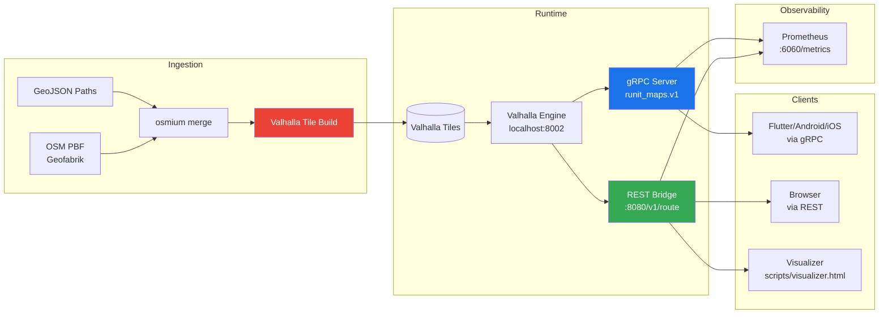

# RunIt Maps

Custom map routing microservice for campus pedestrian navigation. Ingests OpenStreetMap data, merges custom campus paths (GeoJSON), builds Valhalla routing tiles, and serves routes via gRPC + REST.

Built for **MEDILAG** (College of Medicine, University of Lagos / LUTH) and similar campuses with unmapped pedestrian routes.

## Architecture



## Use Cases

| Use Case | Description | API |
|----------|-------------|-----|
| **Pedestrian campus routing** | Walk from one campus building to another using known pathways, avoiding stairs if desired | `Route` (gRPC) / `POST /v1/route` (REST) |
| **Custom path discovery** | Routes that traverse user-mapped campus paths are tagged with `isCustomPath` so the UI can visually distinguish them | Response field `steps[].isCustomPath` |
| **Tile rebuild on path update** | Admin triggers one-shot tile build after GeoJSON edits so new paths are available | `RebuildTiles` / `runit-maps build-tiles <region>` |
| **Health monitoring** | Check if Valhalla is reachable and when tiles were last built | `HealthCheck` (gRPC) / Prometheus metrics |
| **Multi-campus support** | Each region has its own tile set, GeoJSON paths, and build status tracked independently | Config-driven via `config/default.toml` |

## Requirements

- Rust 1.81+
- [protoc](https://github.com/protocolbuffers/protobuf/releases) (proto compilation, set `PROTOC` env var)
- Docker + Docker Compose (for Valhalla engine)

## Quick Start

```bash
# 1. Start Valhalla + the routing service
docker compose up -d valhalla routing-service

# 2. Build tiles for Medilag campus
docker compose --profile build run tile-builder

# 3a. Test with gRPC
grpcurl -plaintext -d '{
  "origin": {"lat": 6.5135, "lng": 3.3515},
  "destination": {"lat": 6.5165, "lng": 3.3490},
  "costing": "CAMPUS_PEDESTRIAN"
}' localhost:50051 runit_maps.v1.RoutingService/Route

# 3b. Test with REST (browser)
open scripts/visualizer.html
```

## REST API

### `POST /v1/route`

**Request:**

```json
{
  "origin": { "lat": 6.5135, "lng": 3.3515 },
  "destination": { "lat": 6.5165, "lng": 3.3490 },
  "costing": "campus_pedestrian",
  "avoidStairs": true,
  "walkingSpeedKmh": 5.0
}
```

**Response:**

```json
{
  "encodedPolyline": "y_|bF|bw}K...",
  "summary": {
    "distanceMeters": 850.0,
    "durationSeconds": 612.0,
    "distanceKm": 0.85,
    "durationFormatted": "10 min"
  },
  "steps": [
    {
      "stepNumber": 1,
      "instruction": "Walk east on Main Gate to LUTH Hospital",
      "streetName": "Main Gate to LUTH Hospital",
      "startLocation": { "lat": 6.5135, "lng": 3.3515 },
      "distanceMeters": 120.0,
      "durationSeconds": 86.0,
      "direction": "east",
      "isCustomPath": true
    }
  ]
}
```

Costing modes: `pedestrian`, `campus_pedestrian`, `auto`, `bicycle`.

## Visualizer

`scripts/visualizer.html` is a standalone Leaflet-based route explorer:

1. Open the file in a browser (served alongside the REST bridge)
2. Click the map to set origin (A) and destination (B)
3. Adjust costing, avoid-stairs, walking speed
4. Click **Get Route** to see the path and step-by-step directions
5. Custom campus paths are highlighted with an orange border

## CLI

```text
Commands:
  serve              Start the gRPC + REST + metrics servers
  build-tiles <id>   One-shot tile build for a region
    --data-dir <path>  Data directory (default: /data)
```

## Configuration

```toml
[server]
grpc_port = 50051
rest_port = 8080
metrics_port = 6060

[ingestion]
custom_paths_dir = "/data/custom_paths"
tile_dir = "/data/tiles"

[[ingestion.regions]]
id = "medilag-campus"
osm_region = "nigeria"
custom_paths_file = "medilag_campus.geojson"
```

Override any value with `RUNIT__` environment variables (e.g. `RUNIT__SERVER__REST_PORT=9090`).

## Observability

- **Prometheus**: `GET /metrics` on port 6060
  - `runit_route_requests_total` — route request count by costing type
  - `runit_valhalla_response_duration_seconds` — Valhalla API latency
  - `runit_tile_build_duration_seconds` — tile build duration by region
  - `runit_errors_total` — error counters by category
- **Tracing**: Structured JSON logs via `tracing-subscriber`

## What's Left

- **Flutter mobile client** — Cross-platform app using the gRPC or REST API
- **C++ custom costing plugin** — `campus_pedestrian` costing logic in `valhalla/campus_cost/` (compile + deploy with Valhalla Docker image)
- **Additional campus data** — LUTH-specific GeoJSON refinement, UNILAG main campus, other Nigerian universities

## Project Structure

```
src/
  main.rs              — CLI entrypoint, server orchestration
  api/
    routing_service.rs  — gRPC Route + HealthCheck handler
    rest_bridge.rs      — axum REST /v1/route endpoint
    admin_service.rs   — Tile rebuild + status via gRPC
  routing/
    client.rs          — Valhalla HTTP client
    response_parser.rs — Valhalla JSON → proto RouteResponse
    validator.rs       — RouteRequest validation
  ingestion/
    osm.rs             — OSM PBF download from Geofabrik
    geojson.rs         — GeoJSON parse, OSM XML conversion, campus path name loading
    tile_builder.rs    — Merge + valhalla_build_tiles orchestration
  common/
    error.rs           — ServiceError enum
    polyline.rs        — Google polyline encode/decode
    metrics.rs         — Prometheus metric init + recording
    telemetry.rs       — tracing-subscriber init
    build_state.rs     — Shared build status tracking
  config/
    mod.rs             — AppConfig struct, env + file loading
scripts/
  visualizer.html      — Leaflet route visualizer (REST client)
proto/runit_maps/v1/
  routing.proto        — gRPC service + message definitions
data/
  custom_paths/        — GeoJSON campus path files
  osm/                 — Downloaded OSM PBF extracts
  tiles/               — Built Valhalla routing tiles
valhalla/
  campus_cost/         — C++ custom pedestrian costing plugin
```

## License

MIT
